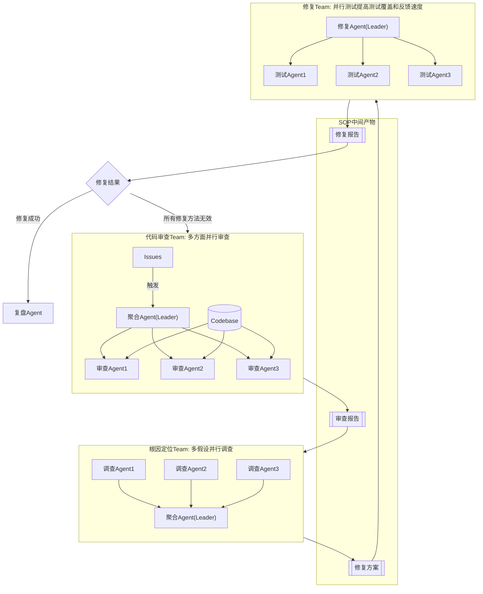

# 设计：面向软件测试场景的 Agent Team

## 1. 多 Agent 系统的优势

- 多 Agent **并行执行**带来的高效率
- 多 Agent **独立推理**无锚定效应 / 去偏见

适用任务：可分解、上下文独立、无前后依赖的任务；或答案多解、错误代价高的决策任务。

## 2. 角色设计（5 个角色类型）

| 角色 | 职责 | 出现位置 |
|---|---|---|
| 聚合 Agent | 缺陷聚合 + 去偏见审查 | T1/T2 的 Leader（聚合多个 worker 的结论） |
| 根因定位 Agent | 多假设并行调查 | T2 的调查 worker |
| 修复 Agent | 方案生成 + 独立评审 | T3 的 Leader |
| 测试验证 Agent | test-based 交叉校验 | T3 的测试 worker |
| 复盘 Agent | 知识沉淀 | 流程收尾（A13） |

## 3. 协同设计（3 个并行 Team + SOP 闭环）

### 流程语义

1. **T1 代码审查**：聚合 Agent 接收 Issues，分发并行审查（多方面角度），产出 `审查报告`
2. **T2 根因定位**：基于审查报告并行调查多个假设，聚合收敛为 `修复方案`
3. **T3 修复**：修复 Agent 依据方案生成实现，并行测试提升覆盖与反馈速度，产出 `修复报告`
4. **分支**：修复成功 → 复盘 Agent 沉淀知识；所有修复方法无效 → 回退 T1 重新审查（不直接重复修复）

## 4. Skills

skills 主要专注于**设计如何写好 SOP 中间产物**：

- **代码审查**：可分别从性能、安全、测试覆盖面等角度并行审查
- **Issues / PRD 撰写**
- **测试**：测试用例模板、测试运行器
- **Debug**

## 5. Eval

- 基准：SWE-bench verified
- 对标（方案效果参考线）：
  - SWE-agent 12.5%
  - MetaGPT 85.9% / 87.7%
