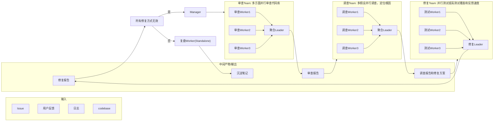

# 设计：面向软件测试场景的 Agent Team

## 1. 多 Agent 系统的优势

- 多 Agent **并行执行**带来的高效率
- 多 Agent **独立推理**无锚定效应 / 去偏见

适用任务：可分解、上下文独立、无前后依赖的任务；或答案多解、错误代价高的决策任务。

## 2. 角色设计（5 个角色类型）

| 角色 | 职责 | 出现位置 |
|---|---|---|
| 聚合 Agent | 缺陷聚合 + 去偏见审查 | T1/T2 的 Leader（聚合多个 worker 的结论） |
| 根因定位 Agent | 多假设并行调查 | T2 的调查 worker |
| 修复 Agent | 方案生成 + 独立评审 | T3 的 Leader |
| 测试验证 Agent | test-based 交叉校验 | T3 的测试 worker |
| 复盘 Agent | 知识沉淀 | 流程收尾（A13） |

## 3. 协同关系设计

