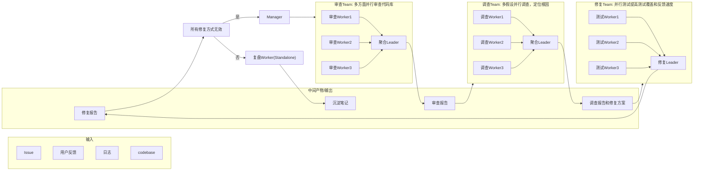

# 一、场景和价值
- 应用场景：软件测试与缺陷管理流程
- 目标用户：软件测试团队，DevOps, QA

解决三类真实痛点：缺陷多源重复上报、根因定位慢、修复后回归风险高

| 痛点     | 现状                             |
| ------ | ------------------------------ |
| 缺陷重复上报 | Issue、日志、用户反馈多源信息零散，人工去重和聚合效率低 |
| 根因定位慢  | 依赖资深工程师经验排查                    |
| 修复回归风险 | 修复的“爆炸半径”难以评估，人在修复压力下存在心态偏差    |

## 痛点一：缺陷多源
多源信息的语义归并不仅难在吞吐量大，还难在每次判断issues是否算是同一缺陷总是要重建上下文。

多Agent系统为何有效：
- 多源拉取天然并行，Issue、日志、用户反馈各派一个 worker，上下文互不污染
- 不同 Agent 持不同判据（标题语义相似 / 报错堆栈相同 / 影响面重叠）并行判断，聚合 Agent裁决分歧——这降低了两类错误：误合并（两个 bug 当一个修，漏一个）和误拆分（一个 bug 修两遍）。

对应的角色和skills设计：比起单Agent，多Agent的增量价值集中在判断的准确性。判重要求每个结论必须附上可核对的证据。聚合 Agent 的裁决标准是"证据质量"而非"结论一致性"

## 痛点二：根因定位慢
慢的原因有两个：搜索空间大；一个工程师会被第一个假设锚定，经验越丰富，叙事越流畅，越难主动证伪自己。

多Agent系统为何有效：
- 任务天然可分解：最近变更假设、配置假设、数据假设、依赖假设……各假设上下文独立、无前后依赖。
- 独立推理去锚定：多个调查 Agent 根据各自的假设取证，再由聚合 Agent 输出调查报告，减少锚定效应。

对应的角色和skills设计：
- 聚合 Agent 不能用"多数投票"收敛。必须要求每个假设带支持证据 + 反驳证据 +
  可复现步骤，证据不足的假设不允许胜出。
- 信息散落在日志、监控、代码、部署系统，这个Team的Agent应该有对应工具去获取这些信息。
- 为了真正地达到独立而不是依赖LLM的输出随机性，需要在分配任务阶段或者是角色设计阶段就给予不同视角。条件允许时混用不同LLM。

## 痛点三：修复回归风险
问题有两个：修复的“爆炸半径”难以评估；人在修复压力下存在心态偏差

多Agent系统为何有效：
- Agent没有deadline焦虑，总是会执行完整的流程
- 评审 Agent 与修复 Agent 隔离（评审者不知道修复者的思路），如果让同一个模型自查自己写的代码，它倾向于复述当初写代码时推理过程中的论证，而不是攻击它
- 修复无效回退至审查阶段而非重复修复，防止在错误的根因上空转
- 比起单Agent，多Agent可以增加测试覆盖面和反馈速度

对应的角色和skills设计：
- 修复提交前：静态分析，单元测试，变异测试，测试影响面分析
- 合并前：CI/CD
- 上线前：灰度发布
- 上线后：监控告警，自动化回滚

# 二、方案设计
系统包含五类 Agent：聚合Agent汇总多源缺陷及各 Worker 证据；根因定位 Agent从代码、配置、数据、依赖等不同假设并行调查；修复 Agent生成修复方案与diff；测试验证 Agent并行执行静态分析、单元测试及影响面验证；复盘 Agent沉淀经验。流程由审查 Team 聚合缺陷并形成审查报告，调查Team 独立取证、定位根因，修复 Team 实施并交叉验证；修复失败则回退重审，成功后输出报告并沉淀知识，实现证据驱动、去偏见的闭环协作
## I/O
- **输入**：多源缺陷/需求（Issue、工单、日志、用户反馈）、代码仓库、测试环境。
- **输出**：对去重后的缺陷清单的审查报告(review-report.json)、根因分析报告和修复方案(fix-plan.json)、测试执行报告(fix-report.json)、复盘知识条目(recap.json)；其中 JSON 为机器可消费的真源，同名 .md 为自动渲染的人类审阅视图。

## 系统架构
![[多Agent协同关系图.png]]

# 三、多Agent协同关系

## 3.2 各 Team 角色与输出

### T1 审查 Team

**组成**：3 个审查 Worker（分别按标题相似度、堆栈指纹、影响面三个判据并行比对）+ 1 个聚合 Leader。

**输出**：审查报告（review-report）。包含去重后的缺陷清单、每条判重决策的证据、合并/驳回的缺陷汇总，以及是否满足进入调查阶段的信息完备性判定。聚合 Agent 按"证据质量"而非"结论一致性"裁决分歧。

### T2 调查 Team

**组成**：3 个调查 Worker（分别从最近变更、配置/数据、依赖/时序三个视角独立取证）+ 1 个聚合 Leader。Worker 持有日志、监控、代码检索、部署信息等工具。

**输出**：调查报告与修复方案（fix-plan）。每个假设必须同时附支持证据与反驳证据、可复现步骤；聚合 Leader 按证据链完整性收敛，禁止多数投票；选定修复方案含影响面评估与回滚策略。

### T3 修复 Team

**组成**：1 个修复 Leader（生成修复方案与实现）+ 3 个测试 Worker（分别执行单元/集成/边界测试）。评审角色与修复角色信息隔离——评审者只看到缺陷描述、修复目标与 diff，不见修复过程推理。

**输出**：修复报告（fix-report）。包含修复实现、影响面分析、独立评审结论、"先红后绿"的缺陷复现测试结果、各测试套件执行汇总。修复无效时不重复修复，直接回退至 T1 重新审查。

### 独立复盘 Agent

**组成**：1 个复盘 Worker，在所有 Team 完成后独立触发，不与三个 Team 耦合。

**输出**：沉淀笔记（recap）。包含缺陷与根因摘要、回归教训、新增回归测试、可回灌至各 Team 的规则条目。

## 3.3 Team 间SOP交接

各 Team 的交接产物采用**结构化格式（JSON + Schema）**，确保下游 Agent 可直接解析消费，且关键字段（证据、复现步骤、回滚策略等）可通过 Schema 验证作为流程门禁，信息不完整的产物不允许进入下一阶段。人类审阅视图由产物自动渲染生成。

# 四、Skill工程体系

# 五、运行验证
