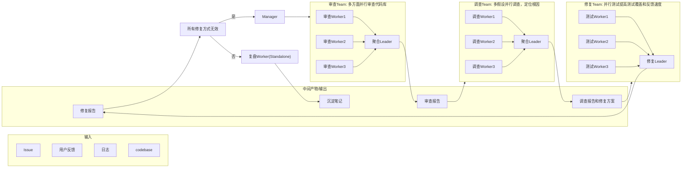

# 一、场景和价值
- 应用场景：软件测试与缺陷管理流程
- 目标用户：软件测试团队，DevOps, QA

解决三类真实痛点：缺陷多源重复上报、根因定位慢、修复后回归风险高

| 痛点     | 现状                             |
| ------ | ------------------------------ |
| 缺陷重复上报 | Issue、日志、用户反馈多源信息零散，人工去重和聚合效率低 |
| 根因定位慢  | 依赖资深工程师经验排查                    |
| 修复回归风险 | 修复的“爆炸半径”难以评估，人在修复压力下存在心态偏差    |

## 痛点一：缺陷多源
多源信息的语义归并不仅难在吞吐量大，还难在每次判断issues是否算是同一缺陷总是要重建上下文。

多Agent系统为何有效：
- 多源拉取天然并行，Issue、日志、用户反馈各派一个 worker，上下文互不污染
- 不同 Agent 持不同判据（标题语义相似 / 报错堆栈相同 / 影响面重叠）并行判断，聚合 Agent裁决分歧——这降低了两类错误：误合并（两个 bug 当一个修，漏一个）和误拆分（一个 bug 修两遍）。

## 痛点二：根因定位慢
慢的原因有两个：搜索空间大；一个工程师会被第一个假设锚定，经验越丰富，叙事越流畅，越难主动证伪自己。

多Agent系统为何有效：
- 任务天然可分解：最近变更假设、配置假设、数据假设、依赖假设……各假设上下文独立、无前后依赖。
- 独立推理去锚定：多个调查 Agent 根据各自的假设取证，再由聚合 Agent 输出调查报告，减少锚定效应。

## 痛点三：修复回归风险
问题有两个：修复的“爆炸半径”难以评估；人在修复压力下存在心态偏差

多Agent系统为何有效：
- Agent没有deadline焦虑，总是会执行完整的流程
- 评审 Agent 与修复 Agent 隔离（评审者不知道修复者的思路），如果让同一个模型自查自己写的代码，它倾向于复述当初写代码时推理过程中的论证，而不是攻击它
- 修复无效回退至审查阶段而非重复修复，防止在错误的根因上空转
- 比起单Agent，多Agent可以增加测试覆盖面和反馈速度

# 二、方案设计
系统包含五类 Agent：聚合Agent汇总多源缺陷及各 Worker 证据；根因定位 Agent从代码、配置、数据、依赖等不同假设并行调查；修复 Agent生成修复方案与diff；测试验证 Agent并行执行静态分析、单元测试及影响面验证；复盘 Agent沉淀经验。流程由审查 Team 聚合缺陷并形成审查报告，调查Team 独立取证、定位根因，修复 Team 实施并交叉验证；修复失败则回退重审，成功后输出报告并沉淀知识，实现证据驱动、去偏见的闭环协作
## I/O
- **输入**：多源缺陷/需求（Issue、工单、日志、用户反馈）、代码仓库、测试环境。
- **输出**：对去重后的缺陷清单的审查报告(review-report.json)、根因分析报告和修复方案(fix-plan.json)、测试执行报告(fix-report.json)、复盘知识条目(recap.json)；其中 JSON 为机器可消费的真源，同名 .md 为自动渲染的人类审阅视图。

## 系统架构
![[多Agent协同关系图.png]]

# 三、多Agent协同关系

## 3.2 各 Team 角色与输出

### T1 审查 Team

**组成**：3 个审查 Worker（分别按标题相似度、堆栈指纹、影响面三个判据并行比对）+ 1 个聚合 Leader。

**输出**：审查报告（review-report）。包含去重后的缺陷清单、每条判重决策的证据、合并/驳回的缺陷汇总，以及是否满足进入调查阶段的信息完备性判定。聚合 Agent 按"证据质量"而非"结论一致性"裁决分歧。

### T2 调查 Team

**组成**：3 个调查 Worker（分别从最近变更、配置/数据、依赖/时序三个视角独立取证）+ 1 个聚合 Leader。Worker 持有日志、监控、代码检索、部署信息等工具。

**输出**：调查报告与修复方案（fix-plan）。每个假设必须同时附支持证据与反驳证据、可复现步骤；聚合 Leader 按证据链完整性收敛，禁止多数投票；选定修复方案含影响面评估与回滚策略。

### T3 修复 Team

**组成**：1 个修复 Leader（生成修复方案与实现）+ 3 个测试 Worker（分别执行单元/集成/边界测试）。评审角色与修复角色信息隔离——评审者只看到缺陷描述、修复目标与 diff，不见修复过程推理。

**输出**：修复报告（fix-report）。包含修复实现、影响面分析、独立评审结论、"先红后绿"的缺陷复现测试结果、各测试套件执行汇总。修复无效时不重复修复，直接回退至 T1 重新审查。

### 独立复盘 Agent

**组成**：1 个复盘 Worker，在所有 Team 完成后独立触发，不与三个 Team 耦合。

**输出**：沉淀笔记（recap）。包含缺陷与根因摘要、回归教训、新增回归测试、可回灌至各 Team 的规则条目。

## 3.3 Team 间SOP交接

各 Team 的交接产物采用**结构化格式（JSON + Schema）**，确保下游 Agent 可直接解析消费，且关键字段（证据、复现步骤、回滚策略等）可通过 Schema 验证作为流程门禁，信息不完整的产物不允许进入下一阶段。人类审阅视图由产物自动渲染生成。

# 四、Skill工程体系

## 4.1 Skill 与角色的对应

| Skill | 使用角色 | 核心职责 |
|---|---|---|
| issue-prd-writing | T1 采集环节 | 将 Issue、日志、用户反馈等多源原始信息归一化为结构化缺陷记录，保留来源可追溯性与字段级证据 |
| code-review | T1 审查 Worker | 按单一判据（标题语义 / 堆栈指纹 / 影响面）比对一对缺陷，产出带证据的判重结论 |
| debug | T2 调查 Worker | 围绕单一假设独立取证，主动寻找支持与反驳证据，尝试证伪自己的假设 |
| repair | T3 修复 Agent | 基于已收敛的根因和修复方案实施最小修复，评估影响面，记录风险与假设 |
| testing | T3 测试 Worker | 按单一验证视角独立检验修复候选，执行"先红后绿"的复现测试，检查是否引入新失败 |

## 4.2 设计原则

- **单一职责、边界显式**：每个 Skill 只做一个动作（一次比对、一个假设、一个视角的验证），并明确列出"必须做"和"禁止做"清单——Worker 不得聚合结论、不得窥探其他 Worker 的推理、不得越权产出最终报告。独立性和信息隔离由此在操作层面强制保证。
- **证据优先于结论**：所有 Skill 都要求结论附带可核对证据，支持证据与反驳证据分开记录；证据不足的结论在聚合阶段直接淘汰。
- **编排与执行分离**：任务分配、分歧裁决、跨视角聚合属于 Leader 职责，不写进 Worker Skill；Skill 只保证单个执行单元的输出质量，避免 Worker 既当运动员又当裁判。
- **产物契约化衔接**：每个 Skill 规定其核心产物的结构化字段（证据、复现步骤、评审结论等），与 Team 间交接的 SOP Schema 对齐，保证下游可直接解析消费，关键字段缺失即被流程门禁拦截。
- **经验可回灌**：复盘产出的规则条目以 Skill 可读的形式沉淀，可回灌至各 Team 的 playbook，形成"修一次、会一类"的闭环增值。

# 五、运行验证

运行验证回答一个核心问题：这套多 Agent 团队是否真的**更高效、更少偏见、更可靠**。验证设计遵循三条原则：指标从结构化产物字段直接计算、以测试用例判定而非 Agent 自报为准、用对照实验隔离"多 Agent"的增量价值。

## 5.1 分层指标体系

| 层 | 回答的问题 | 代表指标 |
|---|---|---|
| L1 端到端 | 团队能不能修好 bug | 修复率、测试验证修复率、回归率、回退率 |
| L2 分阶段 | 每个 Team 对不对 | 去重准确率（误合并 / 误拆分）、根因命中率、假设淘汰有效性、修复门禁通过率 |
| L3 效率成本 | 并行值不值 | 端到端墙钟时间、并行加速比、单位修复成本、平均重试次数 |
| L4 闭环增值 | 复盘有没有用 | 回灌规则命中率、同类缺陷二次修复耗时下降率、逃逸缺陷转测试率 |

其中**测试验证修复率**是最硬的指标：修复是否成功以数据集预置测试用例是否通过为准，而非 Agent 自报"已修复"。两者差距本身就是一个观测项——差距大说明存在"自我评分幻觉"。

## 5.2 数据集

采用 SWE-bench 风格构造带 ground truth 的真实缺陷集：每个缺陷包含问题描述、缺陷代码仓库、真值标注（真实根因、正确修复）和判定测试。判定标准沿用 SWE-bench 的两类测试：

- **fail-to-pass**：修复前失败、修复后必须通过的测试——全部通过才算修复成功；
- **pass-to-pass**：修复前后都必须通过的测试——任一失败即算引入回归。

缺陷类型优先覆盖方案关注的三类场景：并发 / 数据竞争类、历史修复引入的回归类、多源重复上报类，并按难度分层，避免只挑简单缺陷造成修复率虚高。

## 5.3 对照实验

绝对数值无法证明"多 Agent 优于单 Agent"，因此验证包含控制变量的对照实验——同一批缺陷，每次只开关一个设计要素：

| 实验 | 开关的设计要素 | 验证的卖点 |
|---|---|---|
| A1 | 多 Agent 全流程 vs 单 Agent 串行 / 单 Agent 直接修复 | 并行提效 + 去偏见的整体增量 |
| A2 | T3 评审信息隔离开 vs 关 | 独立评审是否真正减少"自查自通过" |
| A3 | 复盘规则回灌开 vs 关 | 知识沉淀的闭环增值 |
| A4 | 证据门禁开 vs 关 | 证据驱动对根因命中率和修复质量的保护 |

每组实验报告统一口径的核心指标并附对比结论；对修复率这类结果报告置信区间而非点估计，并注明模型、温度与随机种子以保证可复现。

## 5.4 验证步骤

1. **指标与契约定稿**：冻结指标定义与评估结果的结构化契约，明确"什么算修好、什么算高效"。
2. **小规模走通**：用手工构造的少量完整缺陷样例跑通"运行 → 采集产物 → 计算指标"全流程，验证指标可算、判定可信。
3. **规模化对照**：在完整缺陷集上运行全量对照实验，产出各层指标与对照结果，形成本章所需的量化证据。

# 六、开源计划
目前项目已在Github开源：https://github.com/xllzi/goai-agt/commits/main/  

